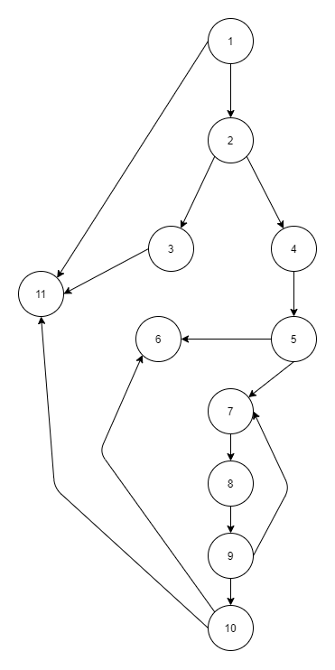

# Втора лабораториска вежба по Софтверско инженерство

## Георгиј Голабоски, 152008

### Група на код: 

Ја добив групата на код: 2

###  Control Flow Graph



### Цикломатска комплексност

Цикломатската комплексност на овој код е 6, истата ја добив преку формулата P+1, каде што P е бројот на предикатни јазли. Во случајoв P=5, па цикломатската комплексност изнесува 6.

### Тест случаи според критериумот  Multiple condition

Во програмата постојат 2 multiple conditions и тоа,

~~~
if (user.getUsername()==null || allUsers.contains(user.getUsername()))
if (!atChar || !dotChar)
~~~

и според тоа ќе ни се потребни следниве тест случаи:

```
True -> username != null & allUsers !contains username
False -> username == null 
False -> allUsers contains username
```
за првиот случај и 

```
True -> atChar & dotChar
False -> !atChar 
False -> !dotChar 
```

### Тест случаи според критериумот Every path

Сите тест случаи ќе бидат:

```
- If user=null -> exception
- if username = null -> exception
- if email = null -> false
- if !atChar || !dotChar -> false
```


### Објаснување на напишаните unit tests

Напишаните unit tests ги покриваат тест случаите покриени погоре, односно според критериумите multiple conditions и every path. За тестирање е користена библиотеката jUnit.
